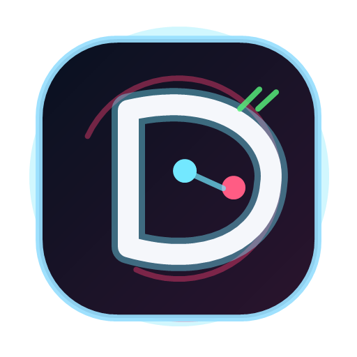
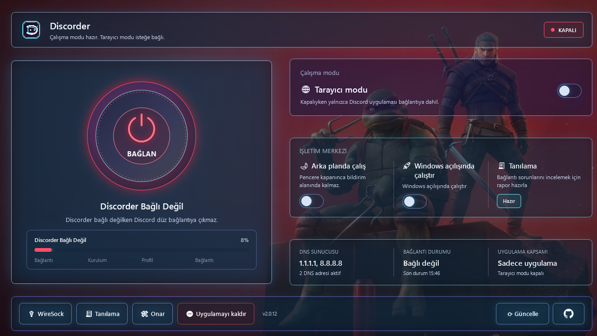
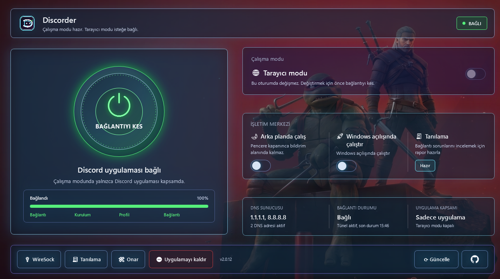

# Discorder

<p align="center">
  
</p>

<p align="center">
  <strong>⚡ Windows için sade, portable ve güvenli Discord bağlantı yöneticisi.</strong>
</p>

<p align="center">
  <a href="https://github.com/ucsahinn/discorder/releases"></a>
  
  
  
</p>

<p align="center">
  <a href="https://github.com/ucsahinn/discorder/releases">⬇️ İndir</a>
  · <a href="docs/kullanim.md">📘 Kullanım</a>
  · <a href="docs/guncelleme.md">🔄 Güncelleme</a>
  · <a href="docs/guvenlik.md">🛡️ Güvenlik</a>
  · <a href="docs/sorun-giderme.md">🧰 Sorun giderme</a>
</p>

Discorder, Windows'ta Discord bağlantı sorunu yaşayan kullanıcılar için geliştirilmiş portable bir masaüstü uygulamasıdır. Discord uygulamasının bağlantısını tek ekrandan yönetir.

Sistem DNS'ini kalıcı değiştirmez, genel cihaz VPN'i gibi davranmaz ve indirdiği üçüncü taraf bileşenleri hash, manifest ve kaynak kontrolleriyle doğrular.

Discorder resmi bir Discord, Cloudflare veya WireSock ürünü değildir. Amaç, kullanıcının neyin çalıştığını net gördüğü, kısa ve güven veren bir bağlantı deneyimi sunmaktır.

## 📸 Ekran Görüntüleri

**Ana ekran - bağlantı kapalı**



**Bağlantı açık ekranı**



## 🧭 Discorder Nedir?

Discorder, Discord uygulaması için hazırlanan dar kapsamlı bir bağlantı aracıdır. Varsayılan kullanımda sadece Discord masaüstü uygulamasına odaklanır. İsteyen kullanıcı Tarayıcı moduyla desteklenen tarayıcıları da bağlantı kapsamına alabilir.

Bu repo, uygulamanın kaynak kodunu, doğrulama betiklerini, güvenlik sınırlarını, release notlarını ve kullanım dokümanlarını içerir.

## ✨ Ne İşe Yarar?

| Özellik | Kullanıcıya etkisi |
| --- | --- |
| 🔌 Tek tuşla bağlantı | Discord bağlantısını açıp kapatmayı kolaylaştırır. |
| 🌐 Tarayıcı modu | Discord Web kullanılıyorsa desteklenen tarayıcıları isteğe bağlı kapsama alır. |
| 📊 Canlı durum kartları | DNS, bağlantı durumu ve uygulama kapsamı gibi bilgileri sade biçimde gösterir. |
| 🧾 Tanılama paketi | Bağlantı sorunlarını incelemek için paylaşılabilir rapor hazırlar. |
| 📦 Portable kullanım | Kurulum sihirbazı olmadan ZIP içinden çalışır. |
| 🔄 Güncelleme akışı | Önce yeni sürümü denetler, sonra kullanıcı isterse yükler. |

## 🛡️ Neden Güvenli?

- 🧩 Sistem DNS ayarını kalıcı değiştirmez.
- 📦 WireSock ve wgcf ikili dosyalarını repoya gömmez.
- ✅ WireSock kurucusunu SHA-256, Authenticode imzası, yayıncı ve sürüm bilgisiyle doğrular.
- 🔐 Otomatik güncelleme paketini GitHub release asset bilgisi, `.sha256.txt`, GitHub digest ve manifest kontrolleriyle eşleştirir.
- 🎯 Discord dışı uygulamaları bilinçli olarak kapsam dışı bırakır.
- 🧼 Gizli profil, hesap ve log dosyalarını repoya veya release arşivine eklemez.

Daha teknik sınırlar için [güvenlik dokümanına](docs/guvenlik.md) ve [SECURITY.md](SECURITY.md) dosyasına bakın.

## ⚡ Hızlı Başlangıç

1. [GitHub Releases](https://github.com/ucsahinn/discorder/releases) sayfasından en güncel `Discorder-*-win-x64.zip` arşivini indirin.
2. ZIP içeriğini istediğiniz klasöre çıkarın.
3. `Discorder.exe` dosyasını çalıştırın.
4. İlk kullanım ekranında WireSock ve WARP koşullarını okuyup onaylayın.
5. Ana ekranda **Bağlan** düğmesine basın.

Release sayfasındaki ZIP paketini manuel indirdiğinizde yanında verilen SHA-256 dosyasıyla kontrol etmeniz önerilir. Uygulama içi otomatik güncelleme zinciri GitHub release yolu, asset digest, SHA-256 dosyası ve manifest eşleşmesi olmadan paketi uygulamaz.

Kullanım adımları, portable klasör önerileri ve ilk kurulum notları için [kullanım rehberini](docs/kullanim.md) okuyun.

## 🔄 Güncelleme Nasıl Çalışır?

Discorder'da güncelleme iki aşamalıdır:

1. **Güncelle** düğmesi yalnızca yeni sürüm olup olmadığını denetler.
2. Yeni sürüm bulunursa ayrı ve belirgin **Yükle** düğmesi görünür.

Yükleme, denetlenen sürümle eşleşen paketi kullanır. Paket önce staging alanına indirilir, doğrulanır, mevcut portable klasör yedeklenir ve ardından `Discorder.exe` yeniden başlatılır. GitHub digest, SHA-256 dosyası veya manifest doğrulaması geçmeyen paket uygulanmaz. Ayrıntılı akış için [güncelleme dokümanına](docs/guncelleme.md) bakın.

## 🗺️ Doküman Haritası

| Konu | Bağlantı |
| --- | --- |
| Kullanım ve ilk çalıştırma | [docs/kullanim.md](docs/kullanim.md) |
| Güncelleme ve portable ZIP davranışı | [docs/guncelleme.md](docs/guncelleme.md) |
| Güvenlik sınırları | [docs/guvenlik.md](docs/guvenlik.md) |
| Sorun giderme | [docs/sorun-giderme.md](docs/sorun-giderme.md) |
| Mimari | [docs/mimari.md](docs/mimari.md) |
| Kaynak sorun denetimi | [docs/kaynak-sorun-denetimi.md](docs/kaynak-sorun-denetimi.md) |
| v2.0.15 release notu | [docs/releases/v2.0.15.md](docs/releases/v2.0.15.md) |

## 🧪 Geliştirme

```powershell
dotnet build Discorder.sln --configuration Release
dotnet run --project tests\Discorder.Core.Tests --configuration Release
dotnet run --project tests\Discorder.Windows.Tests --configuration Release
.\scripts\verify.ps1
```

Release paketi yerel olarak hazırlanacaksa:

```powershell
.\scripts\build-release.ps1
```

Public otomatik güncelleme, GitHub release yolu, GitHub asset digest, yayınlanan SHA-256 dosyası ve paket manifesti eşleşmeden paketi kabul etmez. Kod imzalama ileride eklenirse workflow imzalı paket üretir; sertifika yoksa release imzasız ama GitHub yayın yetkisi + hash/manifest doğrulamalı yayınlanır.

## 🧰 Destek ve Güvenlik

Hata bildirirken Discorder sürümünü, Windows sürümünü, Discord kullanım yolunu ve redakte edilmiş tanılama paketini ekleyin. Özel anahtar, token, cookie, `wgcf-account.toml`, tam WireGuard profili veya kişisel veri paylaşmayın.

Güvenlik açığı bildirmek için [GitHub Security Advisory](https://github.com/ucsahinn/discorder/security/advisories/new) kullanın.

## ⚖️ Lisans ve Üçüncü Taraf Notu

Discorder kaynak kodu bu repodaki [LICENSE](LICENSE) koşullarıyla yayınlanır. WireSock, Cloudflare WARP, Discord ve diğer marka/adlar kendi sahiplerine aittir. Üçüncü taraf sınırları için [THIRD_PARTY_NOTICES.md](THIRD_PARTY_NOTICES.md) dosyasına bakın.
